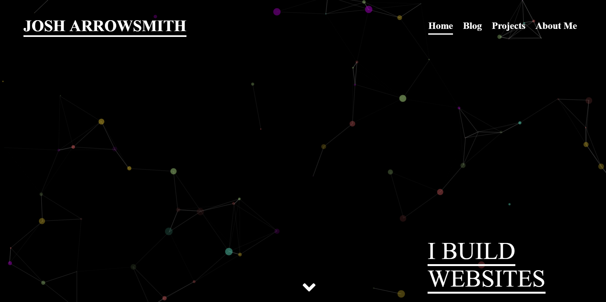

# Portfolio site 
Rebuilding my portfolio site using Gatsby and the Wordpress RESTFUL API, 
its currently sorting blog post by the categories then making a page for said category,
this is only the backend layout of the page for now. 

https://josharrowsmith.netlify.com/

## TODO
- [X] styling everything !!
- [X] particle.js as backgrond ?
- [X] look into how tags and categories work with gatsby
- [X] Use gatsby-plugin for lazy-loading images
- [X] look into how custom post type work with graphql
- [ ] Find a better way to deal with mobile responsiveness
- [ ] Auth stuff
- [X] Fix post pages 
- [ ] About page 
- [ ] Fix first load isssues

